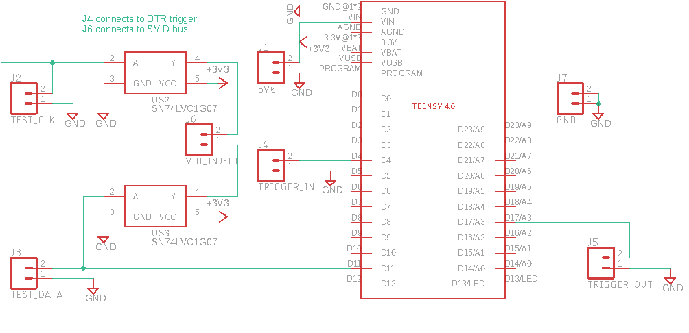

# Voltpillager
## Introduction
This is the Voltpillager repo for CPU undervolting. The folder structure is listed below. Have a look at each folder for further descriptions.  

```
├── additional                  // Supporting Code
│   ├── aes-faulty-block-finder // Code for unwrap AES-CBC
│   ├── dfa-aes                 // DFA analysis of faulty AES result
│   ├── precision               // 5.2 Timing Precision - Jitter test
│   ├── remote-reset            // Raspberry Pi code for turning on and off the motherboard
│   ├── sgx-software-enable     // Code for enabling SGX if it is "software-controlled"
│   └── stability               // Code for processing stability Test and generage diagram 
├── docs                        // Website (TODO)
├── lib                         // Voltpillager Library (Also Plundervolt lib as bonus)
├── poc                         // Folder for PoCs
│   ├── delayed-write           // 6. Delayed Write PoC 
│   ├── mul                     // 5.1 Multiple PoC, and non-enclave glitching framework
│   ├── oe-file-encryptor       // 5.1 OE file encryptor PoC
│   ├── sgx-aes-ni              // 5.1 SGX AES-NI PoC
│   ├── sgx-aes-ni-mbed         // 5.1 Mbed AES-NI PoC
│   ├── sgx-crt-rsa             // 5.1 SGX CRT-RSA PoC
├── voltpillager-firmware       // Voltpillager Teensy4.0 Firmware
└── voltpillager-board          // Schematics for Voltpillager
```

This repo contain submodules, you can run the following commands to get them 
```
git submodule init
git submodule update
```
## Environment Setup
### Enable SGX
There are usually 3 BIOS settings for SGX: (Disabled, Enabled, Software-Controlled). If there are no SGX configurations in BIOS, most probably it doesn't support SGX or it is software-controlled by default. In case of Software-Controlled, you can use `additional/sgx-software-enable` to enable it.
### Set CPU Frequency
`additional/setfreq.sh` can be used for setting cpu frequency. But it require the following package `sudo apt install linux-tools-common linux-tools-generic linux-tools-$(uname -r)`

For temperature monitoring `sudo apt install lm-sensors` is required

### Install SGX SDK and Driver
The PoCs are tested on Intel SGX driver V2.6 and Intel SGX-SDK V2.8. You can run `additional/install_SGX.sh` to install them on a clean Ubuntu 18.04 system. 
### Hardware Requirement 
1. Teensy 4.0 Development Board (~20£)
[[BUY]](https://shop.pimoroni.com/products/teensy-4-0-development-board) 
[[Support]](https://www.pjrc.com/store/teensy40.html)
2. 2 * Bus Driver, you can choose between the following (~1£)
    * SN74LVC1G07DRLR [[BUY]](https://uk.farnell.com/texas-instruments/sn74lvc1g07drlr/buffer-line-driver-non-invert/dp/2334883RL) [[Datasheet]](https://www.ti.com/lit/ds/symlink/sn74lvc1g07.pdf?ts=1591037569523)
    * or NL17SZ07XV5T2G [[BUY]](https://uk.farnell.com/on-semiconductor/nl17sz07xv5t2g/buffer-non-inverting-single-sot/dp/2534484?MER=sy-me-pd-mi-alte) [[Datasheet]](http://www.farnell.com/datasheets/2007350.pdf)
3. SOT IC Adapter (~10£) [[BUY]](https://uk.farnell.com/schmartboard/204-0003-01/ic-adaptor-sc70-soic-sot-to-dip/dp/2483414?ost=204-0003-01) [[Datasheet]](http://www.farnell.com/datasheets/1934984.pdf)

## Connections
### Voltpillager (SVID Interface)
The following diagram shows how to build Voltpillager Board. 


Instructions for using Voltpillager Board

* `VID_INJECT (J6)` is used for connecting to SVID interface
* `TRIGGER_IN (J4)` is used for connecting to trigger (DTR)
* Other test pins can be connect to an oscilloscope for debugging 
* RS232 is 12V, so you'll need to use a voltage level convertor or solder the pin on the 5V side of MAX232 chip out.
* Remember to connect a common GND too :)

### RaspberryPi for Resetting the PC
The system may crash during test, so connect a raspberry pi to the Front Panel power/reset pin could be useful for resetting it when crash. 

We have a simple script for powering on/off or reset the motherboard which can be run on raspberry pi. (See `additional/remote-reset`) 

The following connection is used by the script:
* Front Panel Power - connects to GPIO2
* Front Panel Reset - connects to GPIO3

## Publications
* VoltPillager:  Hardware-based fault injection attacks against IntelSGX Enclaves using the SVID voltage scaling interface (USENIX Security '21) [[LINK]](https://www.usenix.org/conference/usenixsecurity21/presentation/chen-zitai)
